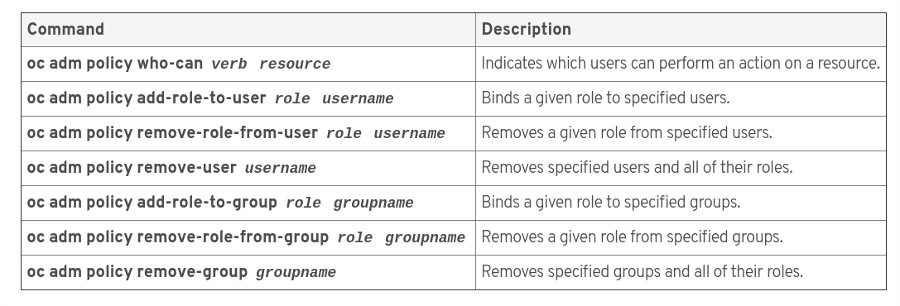

# OpenShift Cheat Sheet

## Useful `oc get`
`oc get all` Return everything <br />
`oc get resouce-type resource-name -o yaml` Return as yaml  <br />

`oc get node node-name.com --show-labels` Return all node labels <br />
`oc get node node-name.com -L region` Return node region <br />
`oc get node node-name.com -L region -L zone` Return node zone <br />

`oc get pods -o wide` Return ip addresses of pods <br />
***

## Useful `oc describe`
`oc describe -n name-space` Resources from specified namespaces <br />
`oc describe is image-stream-name` Describe image stream <br />
`oc describe clusterPolicyBindings :default` Describe who can do what <br />
***

## Useful `oc delete`
`oc delete all -l app=label-name` <br />
***

## Templates
#### Save resource configuration
`oc export resource-type resource-name > output.yaml` Save as template <br />
`oc export svc,dc docker-registry --as-template=docker-registry` Save multiple as template <br />

#### Create resources
`oc create -f yaml_file` <br />
`oc create -f filename -l name=mylabel` applies a label to all resources defined in template

#### Apply changes to a resource definition
`oc apply -f dc.yml`
***

## Logs
#### Events
`oc get events` Return important events <br />
`oc get events --sort-by='.metadata.creationTimestamp'` Events with filters <br /> 

#### Resuource Logs
`oc logs resource-name` 
***

## Logging in
`oc login -u username -p password https://master.example.com` <br />
`oc login https://console.s11.core.rht-labs.com` Logging into s11 <br />
***

## Projects
#### Creating a new project
`oc new-project project-name`
`oc new-project demoproject --description="Project description" --display-name="project-display-name" `

#### Change project
`oc project project-name`
***

### Return high level status of current project
`oc status`
`oc status -v`

### Install the oc command
`sudo yum install atomic-openshift-clients`

### Deploying a new application
`oc new-app --name=app-name image:tag https://registry-url.example.com`<br />
`oc new-app --file=mysql-ephemeral.yml` From a file <br />

### Run a new version of a deployment config
`oc rollout latest dc-name`

### Scale up pods
`oc scale --replicas=2 dc dc-name`

### Create Route
`oc expose service service-name --name route-name --hostname=quoteapp.apps.lab.example.com`

### SSH into pod
`oc rsh <pod>`

### Execute commands against a pod
`oc exec pod-name command`

### Port forwarding
`oc port-forward pod-name local-port:remote-port`

## Cluster Administration



### Grant a user or group a specific SCC
```
oc adm policy add-scc-to-user scc_name user_name
oc adm policy add-scc-to-group scc_name group_name
```

### Remove a user or group from a specific SCC
```
oc adm policy remove-scc-from-user scc_name user_name
oc adm policy remove-scc-from-group scc_name group_name
```

### Add policy to service account
`oc adm policy add-scc-to-user anyuid -z useroot`

### Prevent scheduling on a node
`oc adm manage-node --schedulable=false node-name.com`

### Remove all pods from a node
`oc adm drain node2.lab.example.com`

### Control scheduling of a specific node
`oc patch dc myapp --patch '{"spec":{"template":{"nodeSelector":{"env":"qa"}}}}` Done with dc

### Creating an infra region for common infrastructure pods
`oc annotate --overwrite namespace default openshift.io/node-selector='region=infra'`

### Create regular user
`oc create user user-name`

### Create secret
`oc create secret generic secret_name --from-literal=key1=secret1 --from-literal=key2=secret2`

### Create config map
`oc create configmap special-config --from-literal=serverAddress=172.20.30.40`

### View config map
`oc get configmaps special-config -o yaml`

### Allow secrets to be mounted on pods running under a service account
`oc secrets add --for=mount serviceaccount/serviceaccount-name`

### Create service account
`oc create serviceaccount svc-account-name`

### Add a user with htpasswd
```
ssh openshift-user@master-node
htpasswd -b /etc/origin/master/htpasswd username password
``` 

### Save a resource configuration
`oc export type/resource_name -o yaml > version-dc.yml`

### Update a resource configuration
`oc replace -f version-dc.yml`

### Mount info on NFS server
`showmount`
`showmount -e` show exported mount points

### Mount an NFS volume on a node
`mount -t nfs services.example.com:/var/export/dbvol /mnt`

### Set a persistant volume claim in a dc for a pod
```
oc set volume dc/mysqldb --add --overwrite --name=volume-name -t pvc \
---claim-name=claim-name --claim-size=claim size --claim-mode='ClaimMode'
```

### Schedule on a node with GiB of memory
`oc set resources dc hello --requests=memory=8Gi`

### Tagging an image
`oc tag source destination` permanent tag <br />
`oc tag --alias=true source destination` permanent tag <br />
`oc tag --scheduled=true source destination` reimport tag <br />
`oc tag --reference-policy=local source destination` 

### Check node utilization
`oc adm top node`

### Use diagnostics tool
`oc adm diagnostics`
